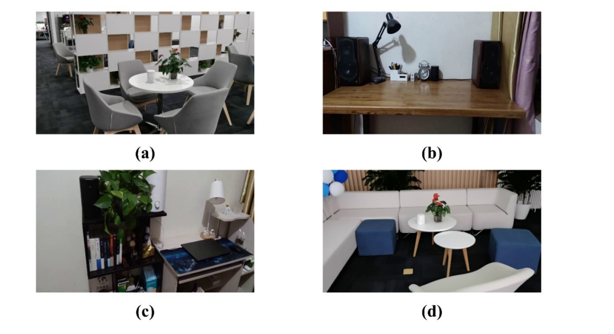

# Southeast University Indoor Smart Speaker Dataset

Southeast University Indoor Smart Speaker Dataset (SUSSD) dataset, which captures usage data from a large number of smart speaker devices. In addition, they capture images of various smart speakers in a room using camera sensors and manually annotate them. The SUSSD dataset comprises of 580 PNG format images with a resolution of 1920×1080. To facilitate training and evaluation, the dataset is randomly split into a training set consisting of 300 images and a test set consisting of 280 images. This dataset can be used for further study and can be applied in their work to enhance the accuracy of smart home device detection systems.

# Download
Please download, fill and sign the SUSSD Agreement and return the whole document to m648167095@gmail.com. The downloaded URL and password will be contained in the replied email.

